# User Stories

1. As a **new user**, I want to **register an account** so I can  **login to the Flashycard's user page**.
2. As a **registered user**, I want to **type in my valid credentials** so I can  **login successfully**.
3. As a **registered user**, I want to **login to the Flashycard's user page** so I can  **use a flashcard deck**.
4. As a **registered user**, I want to **logout of Flashycard's app** so I can  **prevent unwanted modification of my work**.
5. As a **registered user**, I want to **create a flashcard deck** so that I can **store it and use it for studying**.
6. As a **registered user**, I want to **fill in the necessary form fields** so I can  **create my first deck of flashcards**.
7. As a **registered user**, I want to **left-click on Astronomy Flashcards** so I can  **study for my Astronomy Exam**.
8. As a **registered user**, I want to **left-click on a flashcard** so I can  **switch between term and definition**.
9. As a **student of astronomy** I want to **edit my astronomy flashcards** so I can **add or revise information in my study deck**.
10. As a **registered user**, I want to **left-click on  trash can icon next to Astronomy Flashcards** so I can  **delete the Astronomy Flashcards**.
11. As a **registered user**, I want to **left-click on  the corresponding arrows next to the current flash card** so I can  **iterate through the flashcard deck**.

# Acceptance Criteria

1. Scenerio: Register Account in order to login

* Go to the proper website
* Click register account
* Redirect to register page
* Fill in form fields
* Click Submit
* Validate for correct credentials to allow creation. If not, notify user to retry
* New user registers an account with valid credentials
* Redirect to login page
* The new user logins with valid credentials
* The app's features aren't visible until after valid login
* After successful login, redirects to user page
* On user page, flashcard decks are available, modifying and deleting decks are available, and creating new decks are available

2. Scenario: Logging in successfully

* Must be on proper website
* User must be a valid and register user
* User must be logged out and on the login page
* User must enter his/her credentials
* User clicks login
* User is redirected to the user's page

3. Scenario: Using a flashcard deck

* Go to the proper website
* Must be a registered user
* Login successfully
* redirects to user's page
* Displays available flashcard decks
* Decks should be clickable to be able to use
* Click available deck
* Redirect to flashcard use page
* Can iterate through deck using arrow buttons or keys on keyboard

4. Scenario: Logging out

* Must be on proper website
* Be a registered user and are logged in
* Registered user clicks the logout button to logout
* Redirects to login page
* After logout, no modification of the flashcards decks for that user should occur

5. Scenario: Creating a flashcard deck

* Must be on proper website
* Be a registered user and are logged in
* Be at the user's page
* Click the add button in order to access the form fields for flashcard deck creation
* Redirect to flashcard deck creation page

6. Scenario: Creating a flashcard deck

* Must be on proper website
* Be a registered user and are logged in
* Be at the user's page
* Click the add button in order to access the form fields for flashcard deck creation
* Redirect to flashcard deck creation page
* Begin filling out the information (name of deck, terms and definitions)
* Click create button
* Notify user if successfully created deck, otherwise make user retry
* Redirect to Flashcard deck's use page

7. Scenario: Access cards and start studying using flashchard deck

* Must be on proper website
* Must be registered user who is logged in
* User is on their user page
* User has an available deck that has been created
* User clicks on available deck
* User can iterate through cards
* User can click on single flashcard to switch between term and definition

8. Scenario: Click on  pencil icon next to Astronomy Flashcards to edit Flashcards

* Must be on proper website
* Must be registered user who is logged in
* User is on their user page
* User has an available deck that has been created
* User hovers on available deck
* User sees the trash and pencil icons
* User clicks on pencil icon
* User is redirected to edit page
* User makes changes
* User is able to succesfully edit and see changes were made

9. Scenario: Left-click on a flashcard to switch between term and definition

* Go to the proper website
* Must be a registered user
* Login successfully
* redirects to user's page
* Displays available flashcard decks
* Decks should be clickable to be able to use
* Click available deck
* Redirect to flashcard use page
* Can iterate through deck using arrow buttons or keys on keyboard
* Can left-click on single flashcard and be able to switch and see term and definition alternate

10. Scenario: Remove a flashcard deck successfully

* Must be on proper website
* Must be registered user who is logged in
* User is on their user page
* User has an available deck that has been created
* User hovers on available deck
* User sees the trash and pencil icons
* User clicks on trash icon
* User is asked to delete flashcard deck
* User makes makes choice
* User is able to succesfully delete deck and see changes were made

11. Scenario: Click on  the corresponding arrows next to the current flash card to iterate through the flashcard deck

* Go to the proper website
* Must be a registered user
* Login successfully
* redirects to user's page
* Displays available flashcard decks
* Decks should be clickable to be able to use
* Click available deck
* Redirect to flashcard use page
* Can iterate through deck using arrow buttons or keys on keyboard

# Mis-user Stories

1. As a **disgruntled registered user**, I want to **flood the web server with login attempts** so I can **overload the web server so it goes down**.
2. As a **disgruntled registered user**, I want to **enter data in between script tags** so I can **break the website's functionality**.
3. As a **disgruntled registered user**, I want to **perform a SQL injection** so I can **grab user credentials from the data store**.
4. As a **disgruntled registered user**, I want to **brute force login credentials** so I can **login to an account that isn't mine**.

# Mitigation Techniques

1. As a **disgruntled registered user**, I want to **flood the web server with login attempts** so I can **overload the web server so it goes down**.

* Mitigation: In code, only allow an ip to only have so many login attempts at one given time. Temporarily disable their privileges to login after so many attempts
* Mitigation: In code, add Google's protection dependency against this

2. As a **disgruntled registered user**, I want to **enter data in between script tags** so I can **break the website's functionality**.

* Mitigation: In code, add Google's protection dependency against this
* Mitigation: In code, add methods that make sure this can't be done

3. As a **disgruntled registered user**, I want to **perform a SQL injection** so I can **grab user credentials from the database**.

* Mitigation: In code, add Google's protection dependency against this
* Mitigation: In code, add methods that make sure this can't be done

4. As a **disgruntled registered user**, I want to **brute force login credentials** so I can **login to an account that isn't mine**.

* Mitigation: In code, only allow an ip to only have so many login attempts at one given time. Temporarily disable their privileges to login after so many attempts
* Mitigation: In code, add Google's protection dependency against this

# Diagrams

## Mockups

All these mockups are tied to some user story one way or the other. They are all views that have to do with a user story.

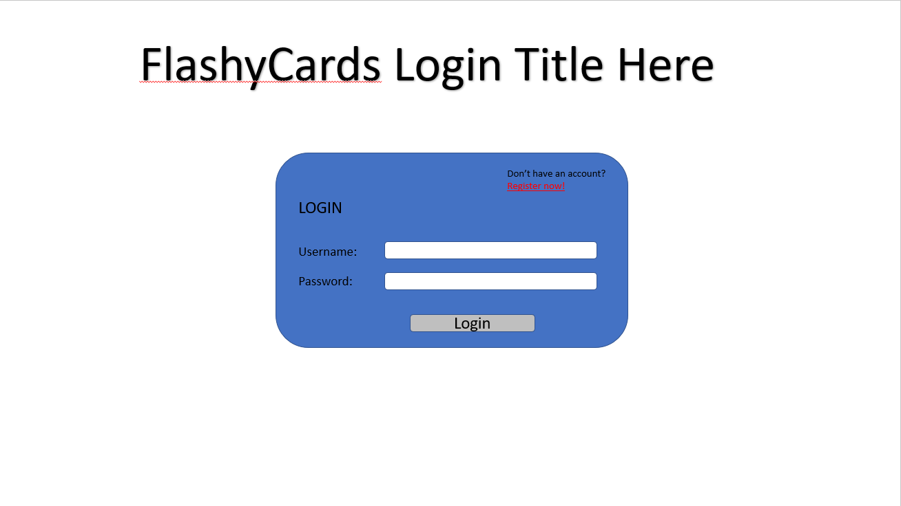

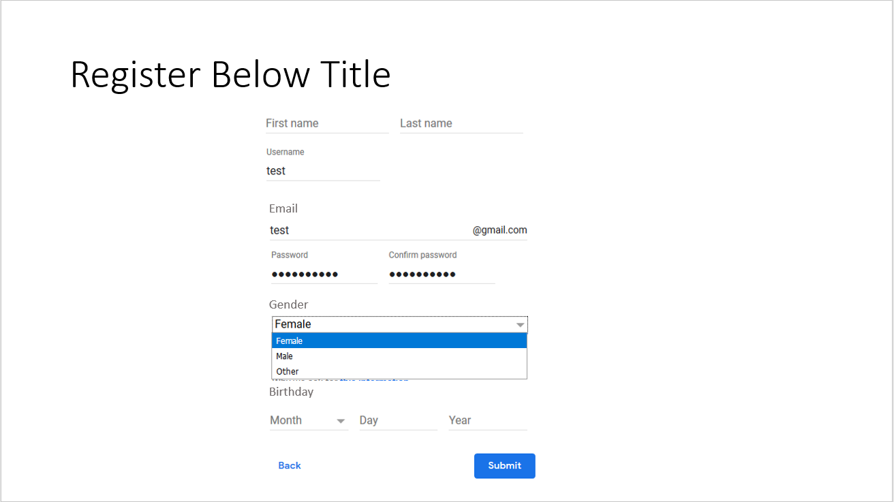

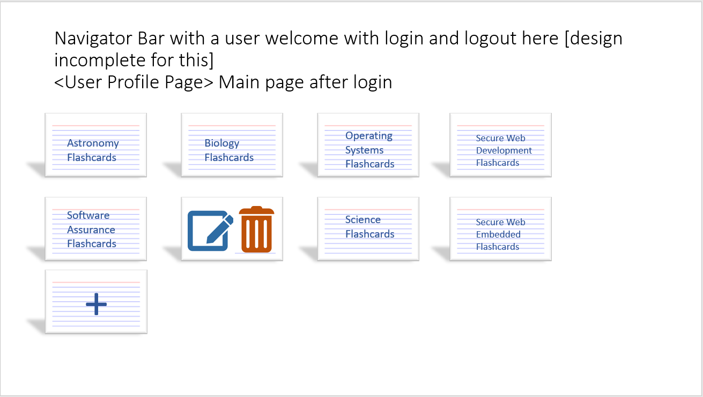

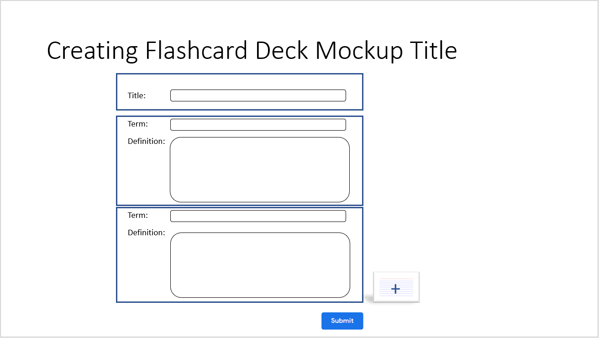

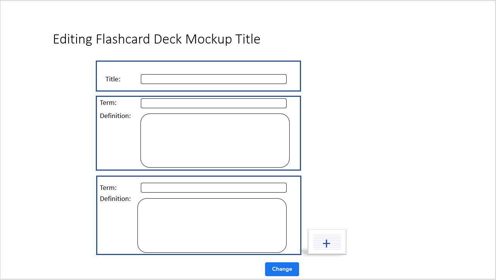

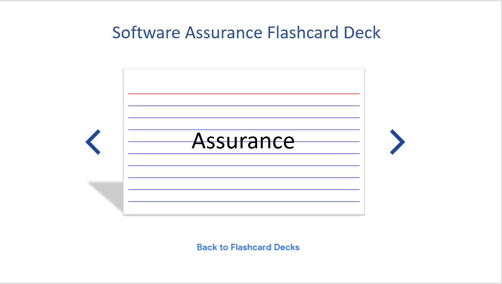

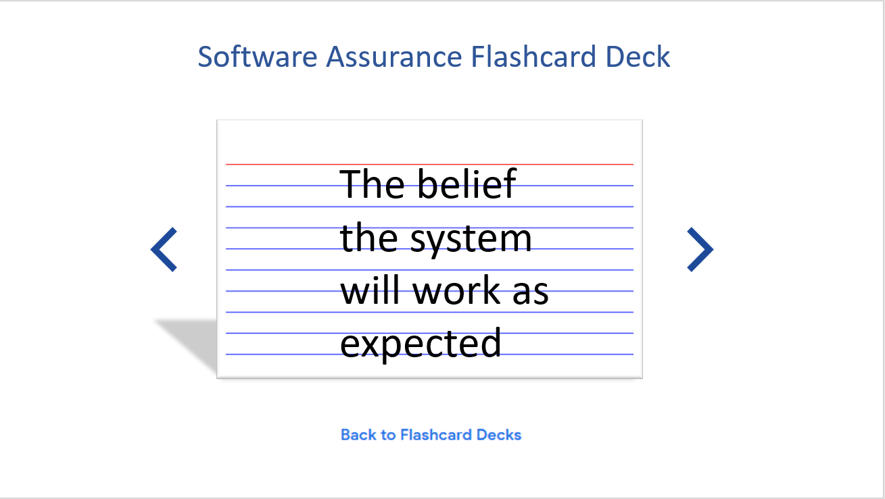

## Architecture Diagram

### Level 1: System Context

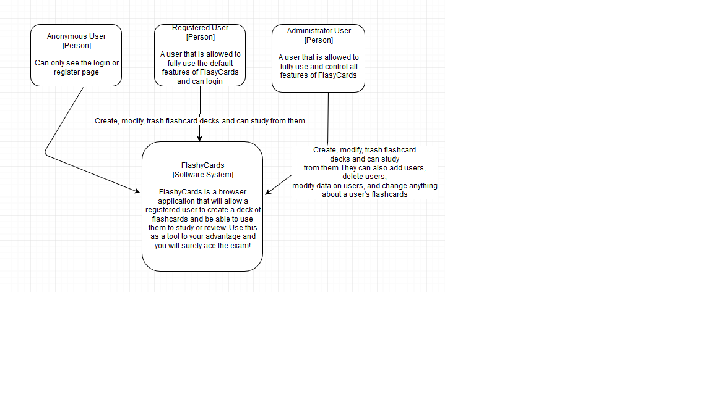

### Level 2: Containers

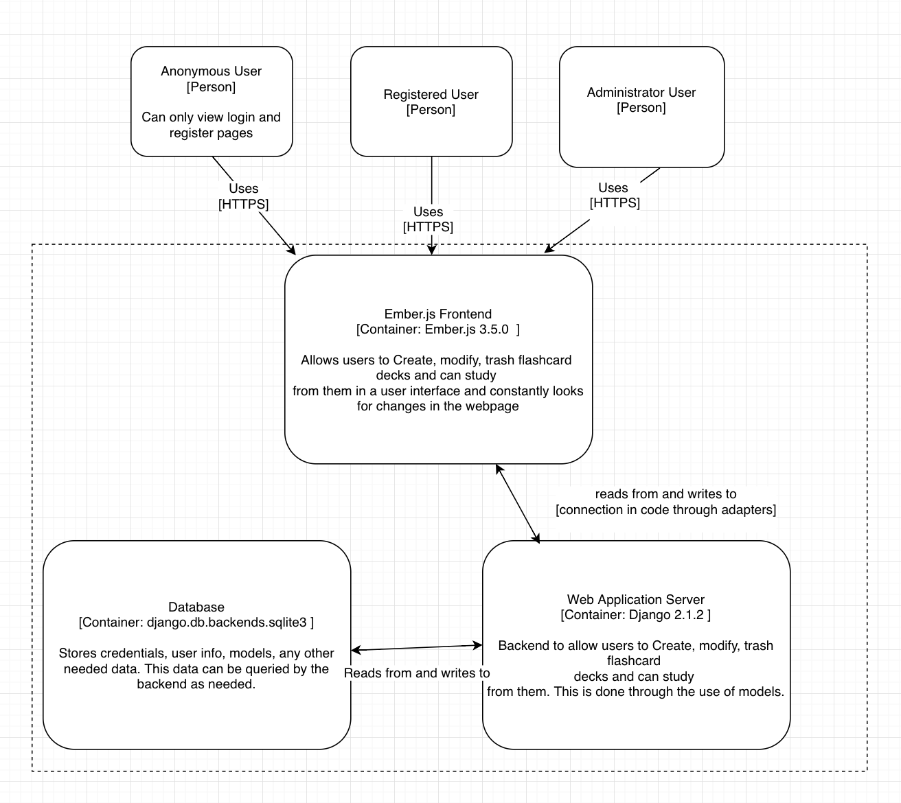

### Level 3: Components

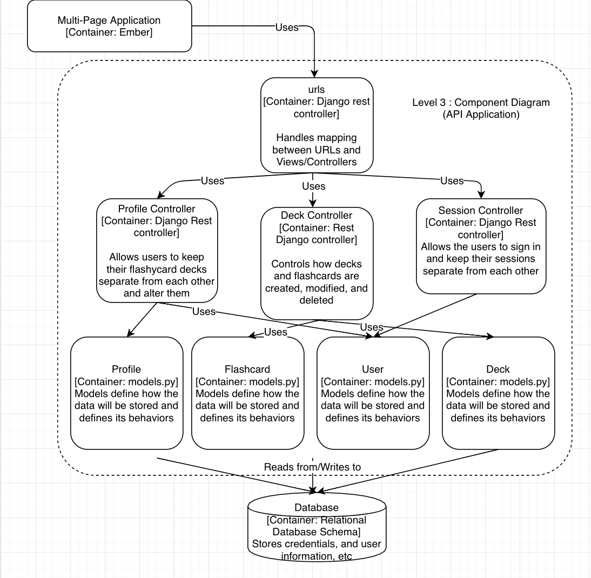

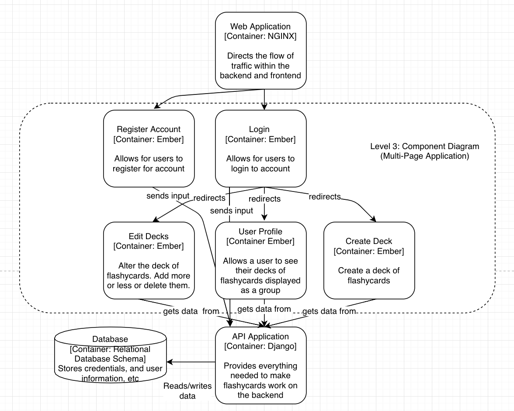
